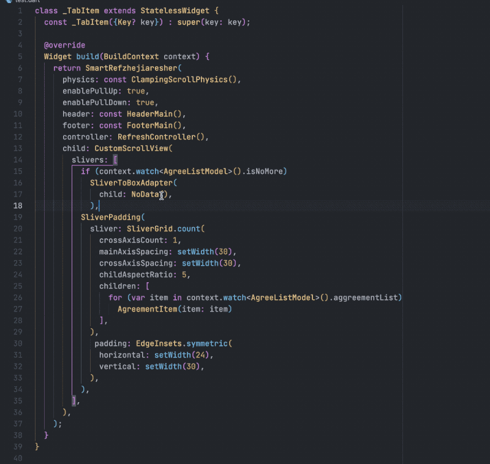
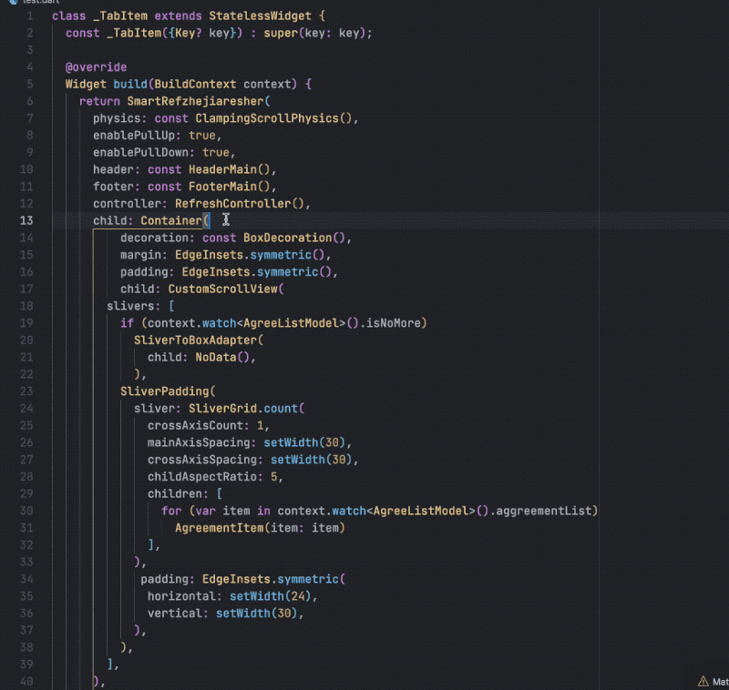
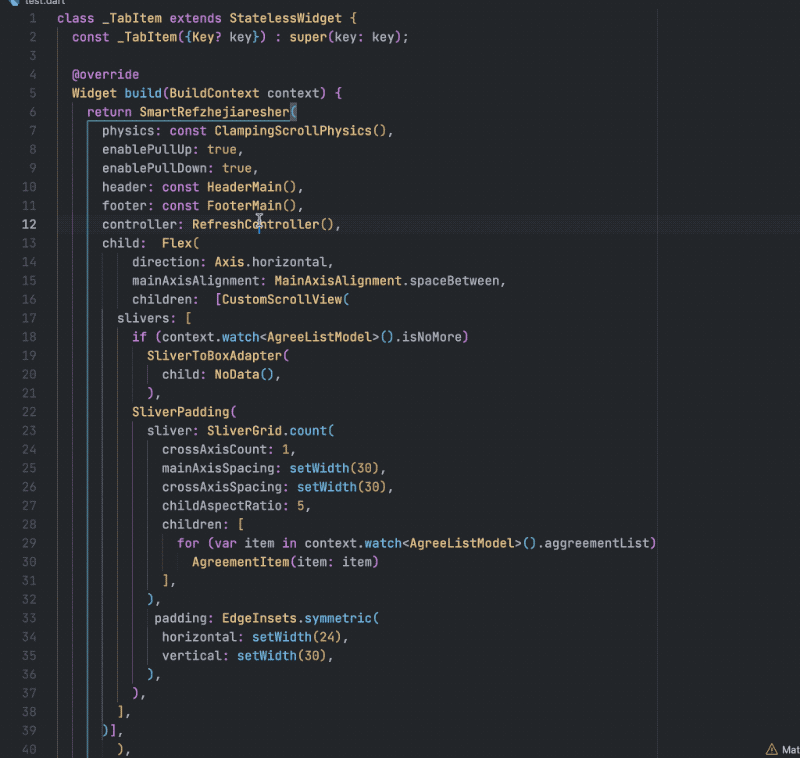
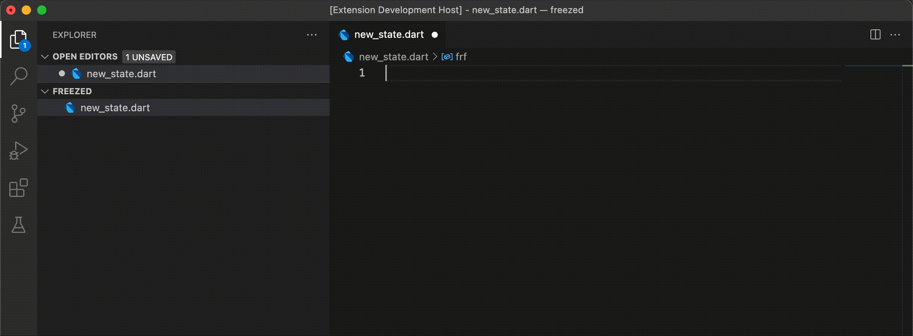
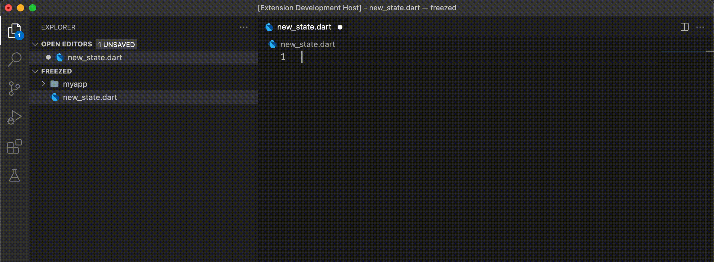
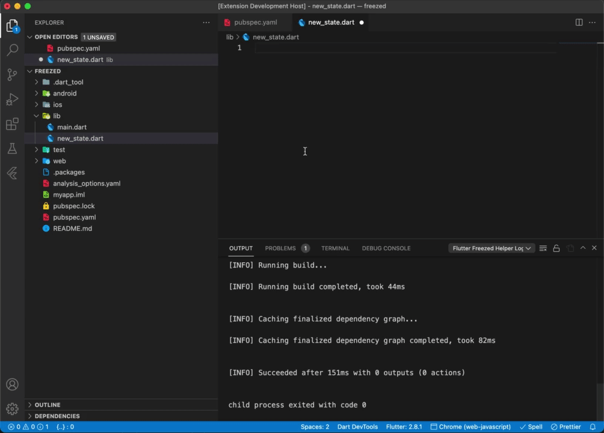

# Flutter Freezed & Riverpod Helpers VSCode Extension

This extension currently helps you to easily write `riverpod & freezed` annotated classes and allows you to run code generation for those classes. You can also watch the files so that code generation is faster.

<!-- 👉 <https://marketplace.visualstudio.com/items?itemName=mthuong.vscode-flutter-freezed-helper> -->

## Setup your flutter project for code generation for JSONSerializable annotations

In your `pubspec.yaml` file add the following libraries in the `dev_dependencies` and `dependencies` section:

```ruby
dev_dependencies:
    // ...
    build_runner:
    freezed:
    riverpod_generator:
    json_serializable:

dependencies:
    // ...
    freezed_annotation:
    flutter_riverpod:
    json_annotation:
    riverpod_annotation:
```


## New Features

### insert a Parent node



### remove a Parent node



### insert a Parent and Sibling node



#### If you only want this feature, you can use this [Extension](https://marketplace.visualstudio.com/items?itemName=evils.vscode-flutter-insert-remove-helper)


## Features

### Snippet for setting up a file with freezed annotated classes: `frf`



### Snippet for creating freezed annotated model: `frc`



### Run Code Gen for freezed annotated classes



### freezed & riverpod annotated classes and watch for changes
* Start watching your entire project using `build_runner watch` by pressing the extension button on the status bar on the bottom.


### Have build runner watch the freezed and riverpod annotated classes and generate code on changes


## Credits
The idea for this extension came from mthuong's extension <https://github.com/mthuong/vscode-flutter-riverpod-helper>
